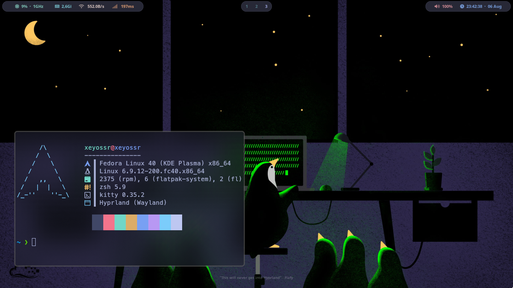

# Xeyossr Dotfiles



```
OS: Fedora 40
WM: Hyprland
Bar: Waybar
Shell: Zsh
Zsh Theme: Powerlevel10k
Terminal: Kitty
```
# Installation
```curl https://raw.githubusercontent.com/xeyossr/dotfiles/main/install.sh | sh```
